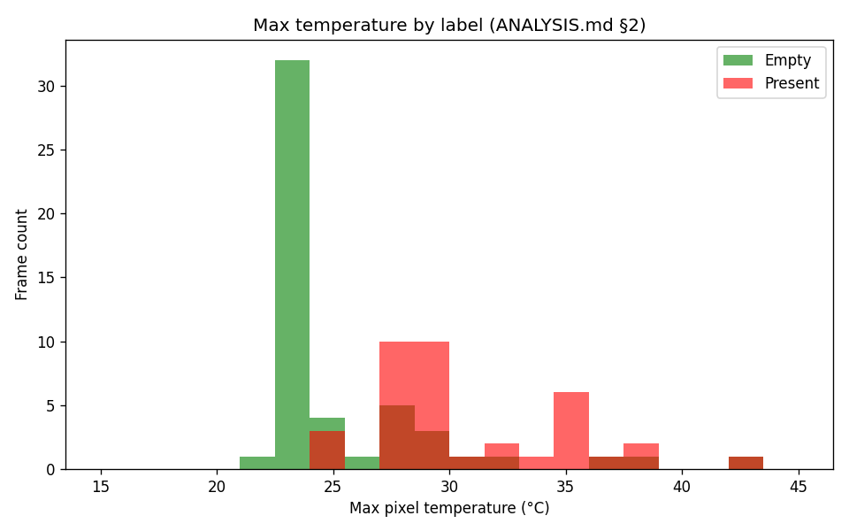
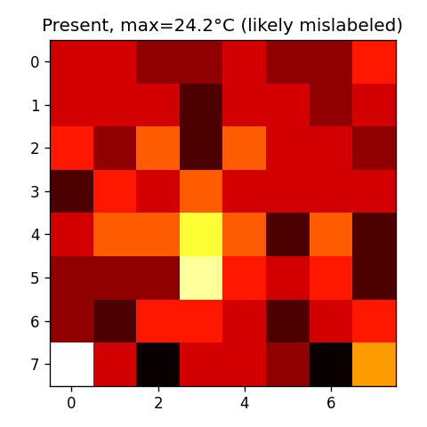
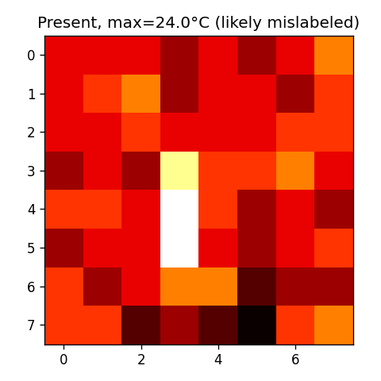
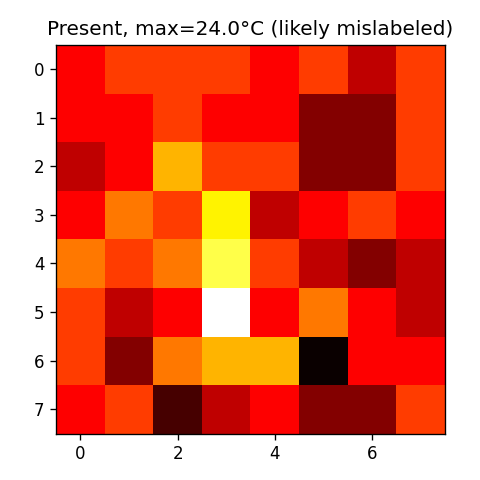

# Dataset Explorer – Analysis

## 1. Is the dataset balanced? If not, what problems could this cause for ML training?

**Answer:** The dataset is **well balanced**. From the class-wide statistics:

- **Empty:** 11,160 frames (~50.6%)
- **Present:** 10,894 frames (~49.4%)
- **Total:** 22,054 frames

The empty vs present ratio is close to 50/50, so no class is strongly underrepresented.

**If the dataset were imbalanced**, typical problems for ML training would be:

- **Class bias:** The model would tend to predict the majority class more often.
- **Poor recall on the minority class:** “Present” (or “empty”) would be missed more often when it is rare.
- **Misleading accuracy:** High accuracy could come from always predicting the majority class; metrics like precision/recall per class and F1 would be more informative.
- **Training dynamics:** Gradient updates would be dominated by the majority class unless we use weighting, oversampling, or other balancing strategies.

---

## 2. What temperature threshold separates "empty" from "present"? Show a histogram.

A reasonable **separating range** between “empty” and “present” is around **26–30°C** for the **maximum pixel temperature** in a frame:

- **Empty** scenes (no person) usually have max pixel temps near room/ambient (e.g. 20–26°C).
- **Present** scenes (person in view) usually have at least one warmer region (e.g. 28–35°C+), so max temp is higher.

So a **max-temperature threshold around 26–28°C** separates the classes.

**Histogram:** From the repo root, run (use your CSV path if different):

```bash
cd challenge2_dataset_explorer/python
uv run python generate_analysis_figures.py ../../challenge1_collection_client/python/my_collection.csv
```

This writes `histogram.png` in `challenge2_dataset_explorer/`:



---

## 3. Find 3 likely mislabeled frames. Show them (as heatmaps) and explain why.

**Definition of “likely mislabeled”:**

- **Label = "present"** but **max pixel temperature &lt; 26°C** → likely **empty** (no warm body in view).
- **Label = "empty"** but **max pixel temperature &gt; 32°C** with a clear hot spot → could be **present** (person) mislabeled as empty.

The same script above saves up to 3 "present" frames with max temp &lt; 26°C as heatmaps (likely mislabeled):

  
  


---

## 4. How does data vary across students? Compare 3 student_ids.

Using the **Contributor Leaderboard** (by_student counts), here is a comparison of **three student_ids**:

| Student ID  | Frame count | Share of total (approx.) | Notes |
|-------------|-------------|---------------------------|--------|
| **A18515258** | 911  | ~4.1%  | Top contributor; many frames, likely good coverage of conditions. |
| **A17749909**  | 305  | ~1.4%  | Mid-tier; meets the 100-frame minimum with room to spare. |
| **A17990116**  | 3    | ~0.01% | Very few frames; may reflect late start or partial submission. |

**Observations:**

- **Volume:** Contribution size varies a lot (from a few frames to hundreds). The top contributors dominate the total frame count; many students are near the 100-frame target.
- **Balance:** We do not see per-student balance here; some students might have submitted mostly “empty” or mostly “present,” which could add local imbalance even though the global dataset is balanced.
- **Quality and diversity:** Larger contributors (e.g. A18515258) likely have more variety (distances, poses, rooms); very small contributors (e.g. 3 frames) add little diversity and may not represent that student well.

For training, it is useful to have many contributors with balanced labels so the model sees varied conditions and avoids overfitting to a few students or environments.

